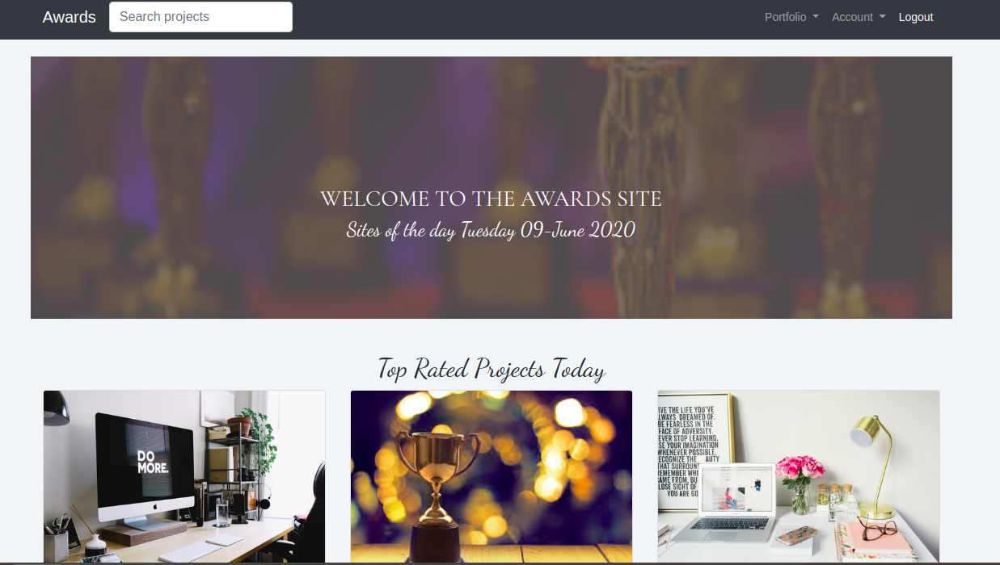

# Awards
#### By:
Beryl Negesa Otieno



### Description  
This is application allows a user to post a project he/she has created and get it reviewed by his/her peers.When you post a project you will be able to rate the project into three parts Usability Design `Content. The application is build with Django Framework in Pthyon.

## User story
As a user of the web application you will be able to:
1. View posted projects and their details
2. Post a project to be rated/reviewed
3. Rate/ review other users' projects
4. Search for projects 
5. View projects overall score
6. View my profile page

### Deployed link


### BDD
| Behavior            | Input                         | Output                        | 
| ------------------- | ----------------------------- | ----------------------------- |
| User visits the app and gets redirected to the register page  | User register | Directed to the login page | 
If user has an account, they click on `login` | User logs in | User is redirected to the home page where can view their pictures or others photos |
|  Home page loads | Add comment  | Comment posted appears |
|  Homepage loads | Click `user name` | User's profile appears | 
| Homepage loads | Click `plus sign` icon | User's redirected to a modal where they can upload an image | 
| Profile page loads | Click `settings` icon | A modal appears where one can change their delete account or logout | 
| Homepage loads | User inputs in the search form and presses enter | Searched results show |
| A list of users displays | Click `follow` button to follow | Reloaded to the homepage

### Setup and Installation  
To get the project .......    
##### Cloning the repository:  
 ```bash 
git clone https://github.com/Beryl01/Awards.git
```
##### Navigate into the folder 
 ```bash 
cd Awards
```
##### Install and activate Virtual  
 ```bash 
python3 -m venv virtual - source virtual/bin/activate  
```  
##### Install Dependencies  
 ```bash 
pip install -r requirements.txt 
```  
##### Setup Database  
SetUp your database User,Password, Host then make migrations
 ```bash 
python manage.py makemigrations
 ``` 
 Now Migrate  
 ```bash 
python3.6 manage.py migrate 
```
##### Run the application  
 ```bash 
python3.6 manage.py runserver 
```  
##### Testing the application  
 ```bash 
python3.6 manage.py test 
```
Open the application on your browser `127.0.0.1:8000`.  
  
## Technologies Used
* Python3.6
* Django 3.0
* HTML5
* CSS3
* Bootstrap4
  
## Known Bugs
None known for now.

## Support and contact details
* Email-berylnegesa@gmail.com

## License
[MIT License](License.md)
Copyright (c) [2020] [Beryl Negesa Otieno]
</a>
